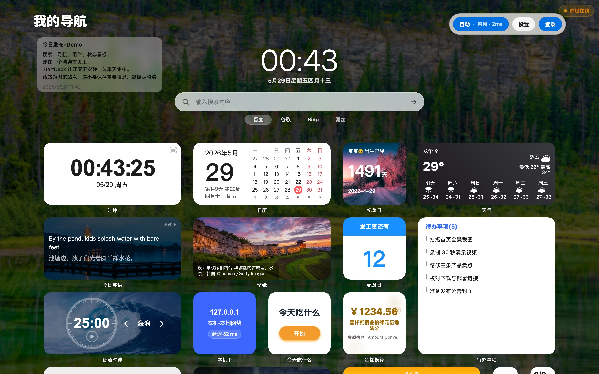
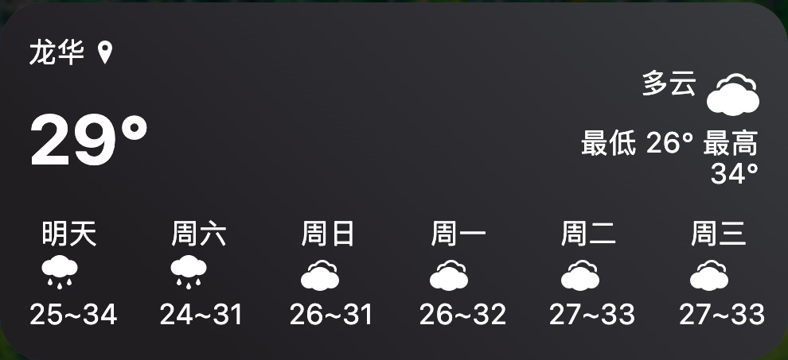
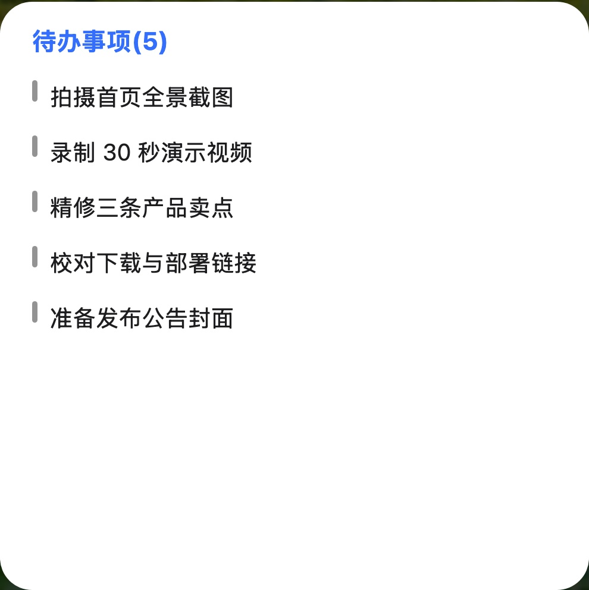
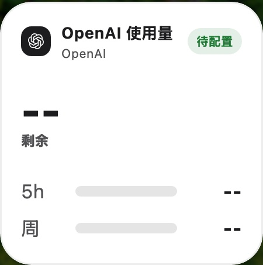
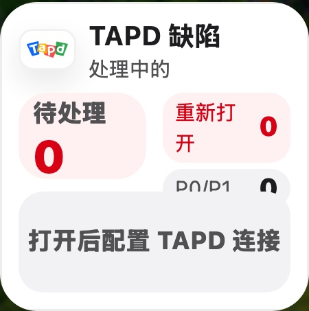

# StartDeck

[](https://github.com/appdev/StartDeck)
[](https://hub.docker.com/r/apkdv/startdeck)
[](LICENSE)

StartDeck 是一个面向 NAS、家庭服务器和个人工作流的自托管浏览器起始页。它把常用站点、内网服务、系统状态、Docker 管理、天气日历、任务备忘和可扩展组件整合到一个可控、可迁移、可长期运行的个人仪表盘中。



## 为什么选择 StartDeck

传统浏览器首页通常只解决“入口收藏”。StartDeck 更关注自托管环境里的日常使用场景：服务很多、地址分内外网、图标和元数据需要自动补齐、系统状态需要一眼可见、个人工具和研发信息也希望留在同一个工作台里。

StartDeck 的目标是成为每天打开浏览器时的第一个生产力界面：

- **自托管优先**：数据、布局、书签、组件配置和上传资源保存在自己的服务器上。
- **NAS / 家庭服务器友好**：适合集中管理内网服务、Docker 容器、工具站点和公网入口。
- **组件化工作台**：时钟、天气、日历、待办、备忘录、Docker、系统状态、AI 使用量、TAPD 缺陷等组件可自由组合。
- **智能访问体验**：支持内网/公网地址配置，结合访问来源与网络状态选择更合适的访问地址。
- **可扩展**：支持自定义 HTML/CSS/JS、iframe、后端代理、全局自定义 CSS 和图标管理。
- **轻量可靠**：Vue 3 前端、Rust 后端、SQLite 本地存储，部署和备份边界清晰。

产品介绍页：部署后访问 `/intro.html`。

## 功能概览

| 能力         | 说明                                                                                                 |
| ------------ | ---------------------------------------------------------------------------------------------------- |
| 可视化首页   | 网格布局、分组管理、搜索引擎切换、站点卡片、组件卡片、编辑模式                                       |
| 组件系统     | 时钟、天气、日历、纪念日、今日诗词、今日英语、电影日历、待办、备忘录、番茄时钟、金额换算、今天吃什么 |
| 系统与运维   | Docker 管理、系统状态、本机 IP、访客统计、版本检测、Docker 镜像更新检测                              |
| 研发工作流   | AI 使用量、TAPD 缺陷组件，适合把研发和 AI 额度信息放进首页                                           |
| 智能网络     | 支持内网地址、公网地址、客户端 IP、访问域名、延迟探测和复杂反代环境                                  |
| 图标与元数据 | 独立 Rust 图标服务，支持站点标题、描述、图标识别和内置图标库                                         |
| 个性化       | 壁纸、移动端壁纸、卡片背景、图标背景色、上传图标、全局 CSS                                           |
| 扩展能力     | 自定义 HTML/CSS/JS 组件、iframe、代理请求、自定义脚本生命周期                                        |

## 当前界面

首页和组件围绕入口、状态与日常操作展开。

| 天气组件                                                              | 待办组件                                                           | AI 使用量                                                                   | TAPD 缺陷                                                               |
| --------------------------------------------------------------------- | ------------------------------------------------------------------ | --------------------------------------------------------------------------- | ----------------------------------------------------------------------- |
|  |  |  |  |

## 架构

StartDeck 由三个主要部分组成：

```text
Browser
  |
  | HTTP / WebSocket
  v
Vue 3 Frontend
  |
  | /api, static assets
  v
Rust startdeck-server
  |
  | SQLite, runtime files, Docker socket, icon API
  v
Rust startdeck-iconserver
```

- **Frontend**：Vue 3、TypeScript、Pinia、GridStack，负责首页、设置、组件运行态和交互。
- **Backend**：Rust + Axum，提供认证、配置持久化、站点元数据、代理、Docker、系统状态、天气/IP 等接口。
- **Icon Service**：独立 Rust 服务，负责图标库、站点图标和图标缓存数据。
- **Storage**：SQLite 保存配置和运行数据，`Data/` 保存上传资源、背景图和图标缓存；Docker 镜像内置前端静态文件。

## 快速开始

### Docker CLI

适合希望最快启动的单机部署。默认 Web 入口为 `9001`，图标服务在容器内通过 `9002` 提供给主服务使用。

```bash
docker run -d \
  --name startdeck \
  --restart unless-stopped \
  -p 9001:9001 \
  -v $(pwd)/Data:/app/Data \
  -e PORT=9001 \
  -e STARTDECK_ADMIN_PASSWORD=change-me \
  -e ICON_SERVICE_PORT=9002 \
  -e ICON_SERVICE_DATA_DIR=/app/Data/icon-service \
  -e ICON_SERVER_BASE_URL=http://127.0.0.1:9002 \
  -e ICON_SERVER_TIMEOUT_MS=5000 \
  -v /var/run/docker.sock:/var/run/docker.sock \
  apkdv/startdeck:latest
```

访问：

```text
http://<server-ip>:9001
```

默认管理员密码为 `admin`。生产部署建议通过 `STARTDECK_ADMIN_PASSWORD` 设置初始密码，并在首次登录后立即修改。

### Docker Compose

```yaml
version: "3.8"

services:
  startdeck:
    image: apkdv/startdeck:latest
    container_name: startdeck
    restart: unless-stopped
    ports:
      - "9001:9001"
    environment:
      - PORT=9001
      - STARTDECK_ADMIN_PASSWORD=change-me
      - ICON_SERVICE_PORT=9002
      - ICON_SERVICE_DATA_DIR=/app/Data/icon-service
      - ICON_SERVICE_RESOURCE_DIR=/app/icon-service-defaults/data
      - ICON_SERVER_BASE_URL=http://127.0.0.1:9002
      - ICON_SERVER_TIMEOUT_MS=5000
    volumes:
      - ./Data:/app/Data
      - /var/run/docker.sock:/var/run/docker.sock
```

如果不需要 Docker 组件管理容器，可以不挂载 `/var/run/docker.sock`。

### Debian / Ubuntu 安装脚本

适合不使用 Docker 的服务器。

```bash
wget -O deploy_debian.sh https://raw.githubusercontent.com/appdev/StartDeck/main/deploy_debian.sh
chmod +x deploy_debian.sh
sudo ./deploy_debian.sh
```

部署完成后可使用管理脚本查看状态、修改端口、配置 HTTPS、查看日志、重启或卸载服务：

```bash
wget -O manage.sh https://raw.githubusercontent.com/appdev/StartDeck/main/manage.sh
chmod +x manage.sh
sudo ./manage.sh
```

### Release 包手动启动

适合已经下载 Release 包并希望自行托管进程的场景。

```bash
cd /opt/startdeck
chmod +x startdeck-server startdeck-iconserver
ICON_SERVICE_PORT=9002 ./startdeck-iconserver &
PORT=9001 ICON_SERVER_BASE_URL=http://127.0.0.1:9002 ./startdeck-server
```

## 生产配置

| 变量                        | 默认值                   | 说明                                                    |
| --------------------------- | ------------------------ | ------------------------------------------------------- |
| `PORT`                      | `9001`                   | StartDeck 主服务监听端口                                |
| `STARTDECK_ADMIN_PASSWORD`  | `admin`                  | 容器启动时同步的管理员密码                              |
| `DATA_DIR`                  | `/app/Data/data`         | SQLite 与运行数据目录                                   |
| `PC_DIR`                    | `/app/Data/PC`           | 桌面端背景图目录                                        |
| `APP_DIR`                   | `/app/Data/APP`          | 移动端背景图目录                                        |
| `STARTDECK_PUBLIC_DIR`      | `/app/startdeck-public`  | 镜像内置前端静态资源目录                                |
| `ICON_SERVICE_PORT`         | `9002`                   | 图标服务端口                                            |
| `ICON_SERVICE_DATA_DIR`     | `/app/Data/icon-service` | 图标服务运行期数据目录                                  |
| `ICON_SERVER_BASE_URL`      | `http://127.0.0.1:9002`  | 主服务访问图标服务的地址                                |
| `ICON_SERVER_TIMEOUT_MS`    | `5000`                   | 图标服务请求超时时间                                    |
| `PROXY_URL`                 | 空                       | 后端代理地址，支持 `http`、`https`、`socks5`、`socks5h` |
| `BASE_PATH`                 | 空                       | 子路径部署时使用，例如 `/startdeck`                     |
| `TENCENT_MAP_KEY`           | 内置默认 Key             | 覆盖腾讯地图 IP 定位 Key                                |
| `TENCENT_MAP_API_HOST`      | 腾讯地图默认地址         | 覆盖腾讯地图 API Host                                   |
| `QWEATHER_API_HOST`         | 空                       | QWeather 备用接口 Host                                  |
| `QWEATHER_PROJECT_ID`       | 空                       | QWeather 项目 ID                                        |
| `QWEATHER_CREDENTIAL_ID`    | 空                       | QWeather 凭证 ID                                        |
| `QWEATHER_PRIVATE_KEY_FILE` | 空                       | QWeather Ed25519 私钥文件路径                           |

QWeather 相关变量需要同时配置后才会启用。私钥建议通过只读 volume 或 Docker secret 挂载，不要写入镜像或仓库。

## 数据、备份与迁移

StartDeck 的运行数据默认集中在以下目录：

```text
Data/data/startdeck.sqlite3        # 布局、书签、组件配置、系统配置
Data/PC/                           # 桌面端背景图
Data/APP/                          # 移动端背景图
Data/icon-service/                 # 图标服务运行期缓存和数据
```

备份建议：

1. 停止容器或服务，避免 SQLite 正在写入。
2. 备份整个 `Data` 目录。
3. 迁移到新服务器后使用相同 volume 路径启动。

## 网络与反向代理

StartDeck 支持常见自托管网络形态：

- 局域网直连
- DDNS / 公网直连
- Nginx、宝塔等反向代理
- Cloudflare Tunnel
- FRP 或其他内网穿透
- 子路径部署，例如 `/startdeck/`
- 前后端分离部署

复杂网络环境请参考 [`README_NETWORK.md`](README_NETWORK.md)。如果需要通过后端代理访问外部资源，可配置 `PROXY_URL`，并在卡片或自定义组件中开启代理请求。

## 安全与隐私

- **本地优先**：配置和运行数据保存在自己的服务器与 SQLite 中。
- **密码保护**：默认提供管理员密码保护；生产环境请设置强密码。
- **Docker Socket 权限**：只有需要 Docker 管理能力时才挂载 `/var/run/docker.sock`。该权限较高，请只在可信服务器上启用。
- **自定义 JS 风险**：全局自定义 JS 和自定义组件脚本具有扩展能力，启用前应确认代码来源可信。
- **代理请求边界**：后端代理适合解决自托管网络访问问题，但不应暴露给不可信用户滥用。
- **密钥管理**：地图、天气、AI、TAPD 等外部服务凭证应通过环境变量、服务端配置或本地安全存储管理，不要提交到仓库。

## 自定义与扩展

### 全局自定义 CSS

在设置面板中可以编写全局 CSS。StartDeck 支持以下语法标签，便于按端和主题拆分样式：

```css
<mobile>
.my-widget {
  display: none;
}
</mobile>

<desktop>
.my-widget {
  border-radius: 18px;
}
</desktop>

<dark>
.my-widget {
  color: #fff;
}
</dark>
```

### 全局自定义 JS

自定义 JS 支持生命周期钩子和 `ctx` 上下文：

```javascript
// @module
export default {
  init(ctx) {
    ctx.on("widget-click", (event) => {
      console.log("Widget clicked:", event.detail);
    });
  },
  update(ctx) {
    console.log("Custom JS updated");
  },
  destroy(ctx) {
    console.log("Custom JS destroyed");
  },
};
```

## 本地开发

### 环境要求

- Node.js `^20.19.0` 或 `>=22.12.0`
- Rust `1.94`
- npm

### 启动开发环境

```bash
cd frontend
npm ci
npm run start:hot
```

也可以分开启动：

```bash
# 终端 1：图标服务
npm --prefix frontend run icon-server

# 终端 2：主服务
npm --prefix frontend run server:hot

# 终端 3：前端开发服务器
npm --prefix frontend run dev
```

默认端口：

| 服务          | 地址                    |
| ------------- | ----------------------- |
| 前端 Vite     | `http://127.0.0.1:9003` |
| StartDeck API | `http://127.0.0.1:9001` |
| Icon Service  | `http://127.0.0.1:9002` |

### 常用命令

```bash
# 前端
cd frontend
npm run build
npm test
npm run test:e2e
npm run lint

# 后端
cargo test --workspace
cargo clippy --workspace --all-targets -- -D warnings
cargo run --bin startdeck-server
cargo run --bin startdeck-iconserver
```

## 目录结构

```text
frontend/                                  # Vue 3 frontend
  src/components/                          # UI components
  src/features/                            # Runtime widgets and feature modules
  src/stores/                              # Pinia stores
  public/                                  # Source static assets
rust/crates/startdeck-server/              # Main Rust backend
rust/crates/startdeck-iconserver/          # Icon metadata service
rust/crates/startdeck-core/                # Shared SQLite/domain code
Data/                                      # Runtime data and generated public assets
debian/                                    # Debian/Ubuntu packaging and service files
Dockerfile
docker-compose.yml
README_NETWORK.md
```

## 发布前检查

```bash
cd frontend
npm run build
npm test

cd ..
cargo test --workspace
cargo clippy --workspace --all-targets -- -D warnings
docker compose up --build
```

对于涉及页面、组件、拖拽、移动端布局或浏览器交互的改动，建议额外执行 Playwright 或浏览器手工验收。

## 项目地址

- GitHub: <https://github.com/appdev/StartDeck>

## License

StartDeck is released under the [GNU AGPLv3](LICENSE).
